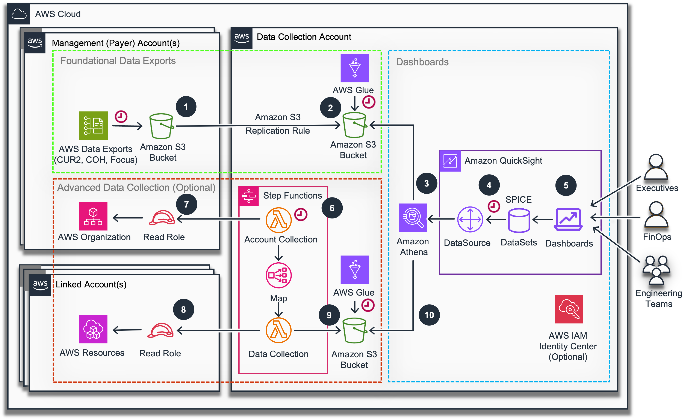

# Cloud Intelligence Dashboards (CUDOS Framework)

## Table of Contents
1. [Overview](#Overview)
1. [Architecture of Foundational Dashboards](#Architecture-of-Foundational-Dashboards)
1. [Cost](#Cost)
1. [Prerequisites](#Prerequisites)
1. [Regions](#Regions)
1. [Deployment Steps](#Deployment-Steps)
1. [Cleanup](#Cleanup)
1. [FAQ](#FAQ)
1. [Changelogs](#Changelogs)
1. [Feedback](#Feedback)
1. [Security](#Security)
1. [License](#License)
1. [Notices](#Notices)

## Overview
The Cloud Intelligence Dashboards is an open-source framework, lovingly cultivated and maintained by a group of customer-obsessed AWSers, that gives customers the power to get high-level and granular insight into their cost and usage data. Supported by the Well-Architected framework, the dashboards can be deployed by any customer using a CloudFormation template or a command-line tool in their environment in under 30 minutes. These dashboards help you to drive financial accountability, optimize cost, track usage goals, implement best-practices for governance, and achieve operational excellence across all your organization.

Cloud Intelligence Dashboards Framework provides AWS customers with [more then 20 Dashboards](https://catalog.workshops.aws/awscid/dashboards/).
* Foundational Dashboards - A set of main Dashboards that only require Cost and Usage Report(CUR)
* Advanced Dashboards - Require CID Data Collection and CUR
* Additional Dashboards - Require various custom datasources or created for very specific use cases.

We recommend starting with deployment of [Foundational Dashboards](https://catalog.workshops.aws/awscid/en-US/dashboards/foundational/cudos-cid-kpi/deploy). Then deploy [Data Collection](https://catalog.workshops.aws/awscid/en-US/data-collection) and [Advanced Dashboards](https://catalog.workshops.aws/awscid/en-US/dashboards/advanced). Check for [Additional](https://catalog.workshops.aws/awscid/en-US/dashboards/additional) Dashboards.

## Architecture of Foundational Dashboards

1. [AWS Data Exports](https://aws.amazon.com/aws-cost-management/aws-data-exports/) delivers daily the Cost & Usage Report (CUR2) to an [Amazon S3 Bucket](https://aws.amazon.com/s3/) in the Management Account.
2. [Amazon S3](https://aws.amazon.com/s3/) replication rule copies Export data to a dedicated Data Collection Account S3 bucket automatically.
3. [Amazon Athena](https://aws.amazon.com/athena/) allows querying data directly from the S3 bucket using an [AWS Glue](https://aws.amazon.com/glue/) table schema definition.
4. [Amazon QuickSight](https://aws.amazon.com/quicksight/) creates datasets from [Amazon Athena](https://aws.amazon.com/athena/), refreshes daily and caches in [SPICE](https://docs.aws.amazon.com/quicksight/latest/user/spice.html)(Super-fast, Parallel, In-memory Calculation Engine) for [Amazon QuickSight](https://aws.amazon.com/quicksight/)
5. User Teams (Executives, FinOps, Engineers) can access Cloud Intelligence Dashboards in [Amazon QuickSight](https://aws.amazon.com/quicksight/). Access is secured through [AWS IAM](https://aws.amazon.com/iam/), IIC ([AWS IAM Identity Center](https://aws.amazon.com/iam/identity-center/), formerly SSO), and optional [Row Level Security](https://catalog.workshops.aws/awscid/en-US/customizations/row-level-security).

This foundational architecture is recommended for starting and allows deployment of [Foundational Dashboards](https://catalog.workshops.aws/awscid/en-US/dashboards/foundational) like CUDOS, CID and KPI.

## Architecture of Advanced Dashboards

1. [AWS Data Exports](https://aws.amazon.com/aws-cost-management/aws-data-exports/) delivers daily the Cost & Usage Report (CUR2) to an [Amazon S3 Bucket](https://aws.amazon.com/s3/) in the Management Account.
2. [Amazon S3](https://aws.amazon.com/s3/) replication rule copies Export data to a dedicated Data Collection Account S3 bucket automatically.
3. [Amazon Athena](https://aws.amazon.com/athena/) allows querying data directly from the S3 bucket using an [AWS Glue](https://aws.amazon.com/glue/) table schema definition.
4. [Amazon QuickSight](https://aws.amazon.com/quicksight/) creates datasets from [Amazon Athena](https://aws.amazon.com/athena/), refreshes daily and caches in [SPICE](https://docs.aws.amazon.com/quicksight/latest/user/spice.html)(Super-fast, Parallel, In-memory Calculation Engine) for [Amazon QuickSight](https://aws.amazon.com/quicksight/)
5. User Teams (Executives, FinOps, Engineers) can access Cloud Intelligence Dashboards in [Amazon QuickSight](https://aws.amazon.com/quicksight/). Access is secured through [AWS IAM](https://aws.amazon.com/iam/), IIC ([AWS IAM Identity Center](https://aws.amazon.com/iam/identity-center/), formerly SSO), and optional [Row Level Security](https://catalog.workshops.aws/awscid/en-US/customizations/row-level-security).
6. Optionally, the Advanced data collection can be deployed to enable advanced dashboards based on [AWS Trusted Advisor](https://aws.amazon.com/premiumsupport/trustedadvisor/), [AWS Health](https://aws.amazon.com/premiumsupport/technology/aws-health-dashboard/) Events and other sources. Additional data is retrieved from [AWS Organizations](https://aws.amazon.com/organizations/) or Linked Accounts. In this case [Amazon EventBridge](https://aws.amazon.com/eventbridge/) rule triggers an [AWS Step Functions](https://aws.amazon.com/step-functions/) workflow for data collection modules on a configurable schedule.
7. The "Account Collector" [AWS Lambda](https://aws.amazon.com/lambda/) in AWS Step Functions retrieves linked account details using AWS Organizations API.
8. The "Data Collection" Lambda function in AWS Step Functions assumes role in each linked account to retrieve account-specific data via [AWS SDK](https://aws.amazon.com/developer/tools/).
9. Retrieved data is stored in a centralized Amazon S3 Bucket.
10. [Advanced Cloud Intelligence Dashboards](https://catalog.workshops.aws/awscid/en-US/dashboards/advanced) leverage Amazon Athena and Amazon QuickSight for comprehensive data analysis.

This advanced data collection architecture allows deployment of [Advanced Dashboards](https://catalog.workshops.aws/awscid/en-US/dashboards/advanced) like Trusted Advisor Dashboard, Health, Graviton, Compute Optimizer Dashboard and many more.

## Cost
The following table provides a sample cost breakdown for deploying of Foundational Dashboards with the default parameters in the US East (N. Virginia) Region for one month. 

| AWS Service                     | Dimensions                    |  Cost [USD]      |
|---------------------------------|-------------------------------|------------------|
| S3 (CUR Storage)                | Monthly storage               | $5-10/month*     |
| AWS Glue Crawler                | Daily scans                   | $3/month*        |
| AWS Athena                      | Daily scans                   | $15/month*       |
| QuickSight Enterprise (Authors) | 3 authors  ($24/month/author) | $72/month**      |
| QuickSight Enterprise (Readers) | 15 readers ($3/month/reader)  | $45/month**      |
| QuickSight SPICE Capacity       | 100 GB                        | $10-20/month*    |
| **Total Estimated Monthly Cost** |                              | **$100-$200**    |

\* Costs are relative to the size of your Cost and Usage Report (CUR) data  
\** Costs are relative to number of Users

**Additional Notes:**
- Free trial available for 30 days for 4 QuickSight users
- Actual costs may vary based on specific usage and data volume

Pleas use AWS Pricing Calculator for precise estimation.

## Prerequisites
You need access to AWS Accounts. We recommend deployment of the Dashboards in a dedicated Data Collection Account, other than your Management (Payer) Account. We provide provides a CloudFormation templates to copy CUR 2.0 data from your Management Account to a dedicated one. You can use it to aggregate data from multiple Management (Payer) Accounts or multiple Linked Accounts.

If you do not have access to the Management/Payer Account, you can still collect the data across multiple Linked accounts using the same approach.

The ownership of CID is usually with the FinOps team, who do not have administrative access. However, they require specific privileges to install and operate CID dashboards. To assist the Admin team in granting the necessary privileges to the CID owners, a CFN template is provided. This template, located at [CFN template](cfn-templates/cid-admin-policies.yaml), takes an IAM role name as a parameter and adds the required policies to the role.

## Regions
Make sure you are installing data collection in the same region where you are going to use the data to avoid cross region charges.
CFN deployment is only available in a limited number of regions, while CLI deployment is region agnostic.

| Region Name | Region Code | Support CLI  | Support CFN |
|:------------ | :-------------| :-------------| :------------- |
| Africa (Cape Town) | af-south-1 | :heavy_check_mark: |   |
| Asia Pacific (Tokyo) | ap-northeast-1 | :heavy_check_mark: | :heavy_check_mark: |
| Asia Pacific (Seoul) | ap-northeast-2 | :heavy_check_mark: | :heavy_check_mark: |
| Asia Pacific (Mumbai) | ap-south-1 | :heavy_check_mark: | :heavy_check_mark: |
| Asia Pacific (Singapore) | ap-southeast-1 | :heavy_check_mark: | :heavy_check_mark: |
| Asia Pacific (Sydney) | ap-southeast-2 | :heavy_check_mark: | :heavy_check_mark: |
| Asia Pacific (Jakarta) | ap-southeast-3 | :heavy_check_mark: |   |
| Canada (Central) | ca-central-1 | :heavy_check_mark: | :heavy_check_mark: |
| China (Beijing) | cn-north-1 | :heavy_check_mark: |   |
| Europe (Frankfurt) | eu-central-1 | :heavy_check_mark: | :heavy_check_mark: |
| Europe (Zurich) | eu-central-2 | :heavy_check_mark: |   |
| Europe (Stockholm) | eu-north-1 | :heavy_check_mark: | :heavy_check_mark: |
| Europe (Milan) | eu-south-1 | :heavy_check_mark: |   |
| Europe (Spain) | eu-south-2 | :heavy_check_mark: |   |
| Europe (Ireland) | eu-west-1 | :heavy_check_mark: | :heavy_check_mark: |
| Europe (London) | eu-west-2 | :heavy_check_mark: | :heavy_check_mark: |
| Europe (Paris) | eu-west-3 | :heavy_check_mark: | :heavy_check_mark: |
| South America (São Paulo) | sa-east-1 | :heavy_check_mark: | :heavy_check_mark: |
| US East (N. Virginia) | us-east-1 | :heavy_check_mark: | :heavy_check_mark: |
| US East (Ohio) | us-east-2 | :heavy_check_mark: | :heavy_check_mark: |
| AWS GovCloud (US-East) | us-gov-east-1 | :heavy_check_mark: |   |
| AWS GovCloud (US-West) | us-gov-west-1 | :heavy_check_mark: |   |
| US West (Oregon) | us-west-2 | :heavy_check_mark: | :heavy_check_mark: |

## Deployment Steps
There are several ways we can deploy dashboards:
1. Using cid-cmd tool from command line
1. [CloudFormation Template](./cfn-templates/cid-cfn.yml) using cid-cmd tool in Amazon Lambda. (Recommended)

Please refer to the deployment documentation [here](https://catalog.workshops.aws/awscid/en-US/dashboards/foundational/cudos-cid-kpi/deploy).

## Cleanup
Please refer to the documentation [here](https://catalog.workshops.aws/awscid/en-US/dashboards/teardown).

## FAQ
Please refer to the documentation [here](https://catalog.workshops.aws/awscid/en-US/faqs).

## Changelogs
For dashboards please check Change Logs [here](changes/)
For CID deployment tool, including Cli and CFN please check [Releases](/releases)

## Feedback
Please reference to [this page](https://catalog.workshops.aws/awscid/en-US/feedback-support)

## Security
When you build systems on AWS infrastructure, security responsibilities are shared between you and AWS. This [shared responsibility
model](https://aws.amazon.com/compliance/shared-responsibility-model/) reduces your operational burden because AWS operates, manages, and
controls the components including the host operating system, the virtualization layer, and the physical security of the facilities in
which the services operate. For more information about AWS security, visit [AWS Cloud Security](http://aws.amazon.com/security/).

See [CONTRIBUTING](CONTRIBUTING.md#security-issue-notifications) for more information.

## License
This library is licensed under the MIT-0 License. See the [LICENSE](LICENSE) file.

## Notices
Dashboards and their content: (a) are for informational purposes only, (b) represents current AWS product offerings and practices, which are subject to change without notice, and (c) does not create any commitments or assurances from AWS and its affiliates, suppliers or licensors. AWS content, products or services are provided “as is” without warranties, representations, or conditions of any kind, whether express or implied. The responsibilities and liabilities of AWS to its customers are controlled by AWS agreements, and this document is not part of, nor does it modify, any agreement between AWS and its customers.