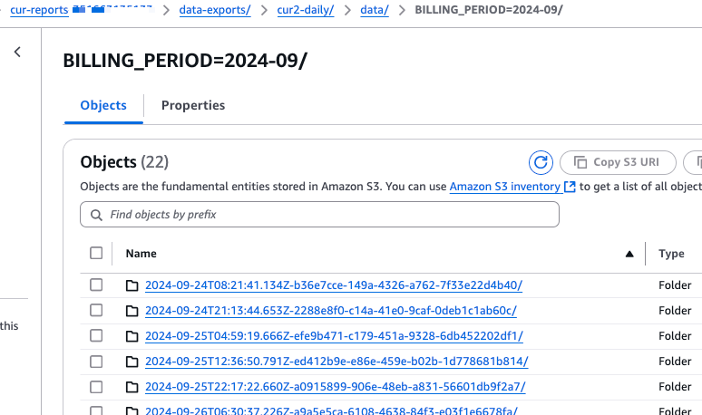

## Set Up CUDOS CUR2 Dashboard

### Confirm QuickSight Configurations
1. QuickSight Enterprise Enabled
1. Give permissions to access IAM, Athena, S3. RDS and Redshift are not required for CUDOS dashboards 
    

### Configure S3 Bucket for CUR2 Data
1. Create or use an existing s3 bucket
1. Set up CUR2 export using standard (an additional partition other than `billing_period`) or overriding mode
    

### Deploy Dependencies
1. Collect the params for deploying dashboard prerequisites
    - CidBucket: the pre-exist bucket without path where the Athena query results will go to
    - QuickSightDataSourceRoleName: the name of the IAM role to be created for QuickSight data source to assume
    - RolePath: the above IAM role path
    - Prefix: the prefix for Lambda function and IAM role and policy names
    - AthenaWorkgroup: the preferred name of the Athena work group to be created
    - DatabaseName: the name of the Glue/Athena database to be created to hold dashboard data elements
1. Run CloudFormation `iac/prerequisites.yaml` to provision or update 
    * `CidQuickSightDataSourceRole` IAM role
    * `cid` Glue database
    * `CID` Athena workgroup
1. Use Glue Crawler to create CUR2 table or run Athena scripts under `cid-govcloud/db/cid/tables` folder to create the table
1. Run Athena scripts under `cid-govcloud/db/cid/views` folder to create the dashboard views

### Deploy Analysis
1. Update or adjust `iac/cid/cid-analysis.json` CloudFormation template as needed
1. Minify `iac/cid/cid-analysis.json` and paste the contents to `iac/cid/cid-analysis-mini.json`
1. Run CloudFormation deployment using `iac/cid/cid-analysis-mini.json`
