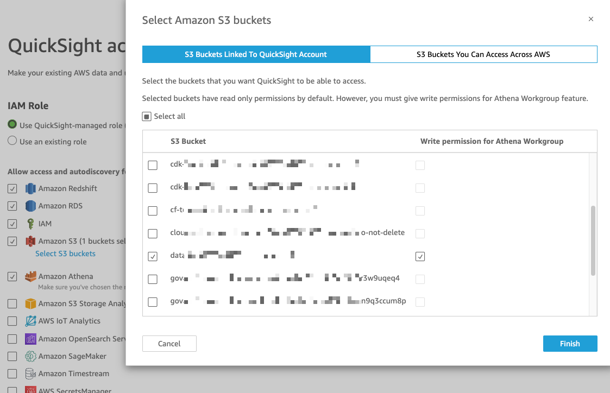
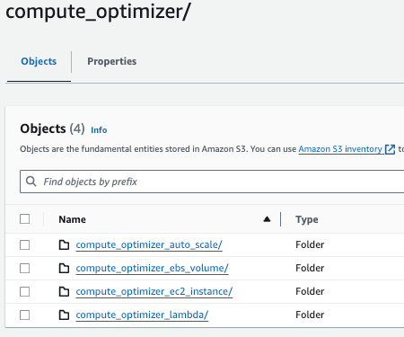

## Set Up Compute Optimizer Dashboard

### Confirm QuickSight Configurations
1. QuickSight Enterprise Enabled
1. Give permissions to access IAM, Athena, S3. RDS and Redshift are not required for Compute Optimizer dashboard
    

### Configure S3 Bucket for Compute Optimizaer Data
1. Create or use an existing s3 bucket
1. Create paths for Compute Optimizer data
    
1. Upload your data files that matche the data schemas under `dashboards/db/data-schema` folder into their proper folders ***OR***
1. Configure Compute Optimizer export and EventBrige cross region forwarding rule for automated data updates

### Deploy Dependencies
1. Collect the params for deploying dashboard prerequisites
    - CidBucket: the pre-exist bucket without path where the Athena query results will go to
    - QuickSightDataSourceRoleName: the name of the IAM role to be created for QuickSight data source to assume
    - RolePath: the above IAM role path
    - Prefix: the prefix for Lambda function and IAM role and policy names
    - AthenaWorkgroup: the preferred name of the Athena work group to be created
    - DatabaseName: the name of the Glue/Athena database to be created to hold dashboard data elements
1. Run CloudFormation `iac/prerequisites.yaml` to deploy 
    * `CidQuickSightDataSourceRole` IAM role
    * `cid_cur` Glue database
    * `CID` Athena workgroup
1. Run Athena scripts under `cid-govcloud/db/co/tables` folder to create tables
1. Run Athena scripts under `cid-govcloud/db/co/views` folder to create views

### Deploy Analysis
1. Update or adjust `iac/co/co-analysis.json` CloudFormation template as needed
1. Minify `iac/co/co-analysis.json` and paste the updated contents to `iac/co/co-analysis-mini.json`
1. Run CloudFormation deployment using `iac/co/co-analysis-mini.json`
