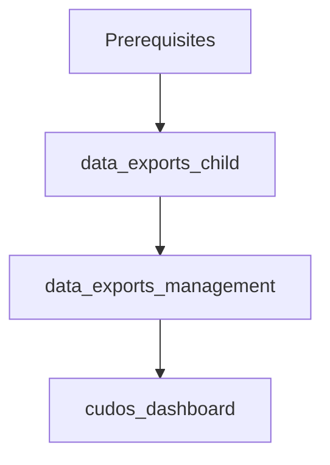

# Cloud Intelligence Dashboards Terraform Deployment

This repository contains Terraform configurations for deploying AWS Cloud Intelligence Dashboards (CID) using CloudFormation templates as wrappers.

## Deployment Methods

### 1. Manual Deployment
Deploy resources in the following order:

1. `data_exports_child` in Destination Account (Child/Linked Account)
2. `data_exports_management` in Payer Account (Management/Org Master Account)
3. `cudos_dashboard` in Destination Account (Child/Linked Account)

### 2. CICD Pipeline Deployment
Use the configurations in the `cicd-deployment` directory with appropriate provider configurations for each account.

## Prerequisites

- Complete QuickSight setup and other requirements as per [CID Framework workshop](https://catalog.workshops.aws/awscid/en-US)
- Configure necessary IAM permissions in both AWS accounts
- Review and update all required variables

## Configuration

You can configure the deployment using either:
- Direct modification of `variables.tf`
- Creating `terraform.tfvars` (recommended)

### Variable Management
- Global variables are shared across multiple resources
- Resource-specific variables are grouped by resource
- Follow [CID Framework workshop](https://catalog.workshops.aws/awscid/en-US) guidelines for variable values

## Deployment Verification

After each resource deployment, verify:
1. Check outputs displayed after terraform apply
2. Verify CloudFormation stacks in respective AWS accounts
   - Ensure correct region is selected
   - Review stack status and resources
   - Check for any error messages

## Important Notes

- Ensure resources are deployed in the specified order
- Provider configurations in CICD deployment must specify correct target accounts
- Follow AWS Well-Architected best practices

## Directory Structure

```
.
├── manual-deployment/
│   ├── cur-setup-destination/
│   │   ├── main.tf
│   │   ├── variables.tf
│   │   ├── outputs.tf
│   │   ├── providers.tf
│   │   └── terraform.tfvars.example
│   ├── cur-setup-source/
│   │   ├── main.tf
│   │   ├── variables.tf
│   │   ├── outputs.tf
│   │   ├── providers.tf
│   │   └── terraform.tfvars.example
│   └── cid-dashboards/
│       ├── main.tf
│       ├── variables.tf
│       ├── outputs.tf
│       ├── providers.tf
│       └── terraform.tfvars.example
└── cicd-deployment/
    ├── main.tf
    ├── variables.tf
    ├── outputs.tf
    ├── providers.tf
    └── terraform.tfvars.example
```


## Resource Dependencies



## Best Practices

- Use terraform.tfvars for environment-specific configurations
- Implement proper state management
- Follow secure credential management practices
- Regularly review and update configurations
